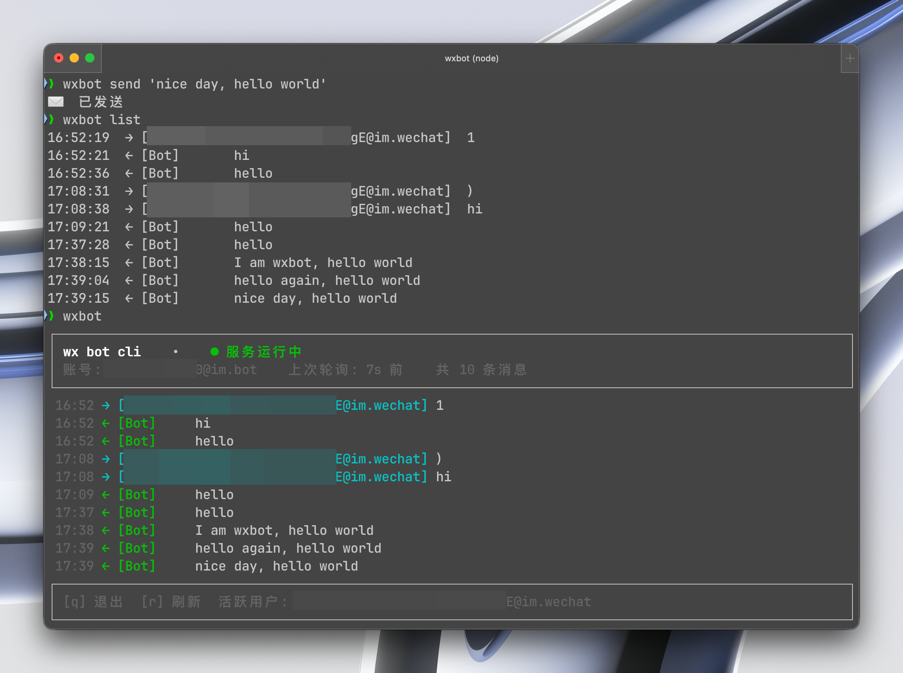

# wxbot — 微信 AI Bot CLI

[English](README.en.md)



`wxbot` 是一个微信机器人命令行工具，基于微信 iLink API，提供扫码登录、消息收发、SQLite 持久化存储，以及 Ink 终端看板（TUI）。

它以守护进程的形式常驻后台（由 **launchd** / **systemd** 托管，开机自启、崩溃自恢复），随时待命接受调用——这让它天然适合以下几类场景：

- **多平台调用**：在 Claude、OpenClaw 等任意 AI 实例中，一条命令即可发出微信消息，无需关心当前在哪个平台。
- **脚本与自动化通知**：嵌入到部署流程、定时任务或监控告警中，让关键事件的通知自动送达微信。
- **接入 Agent 应用**：开发 Agent 时无需额外插件，通过 Agent + Skill 直接调用 CLI，即可快速获得微信消息发送能力。

---

## 功能特性

- **扫码登录** — 终端内渲染二维码，用微信扫描即可完成授权
- **系统服务** — 自动注册为 launchd / systemd 用户服务，无需手动守护
- **长轮询收消息** — 后台持续拉取新消息，写入 SQLite（WAL 模式）
- **会话额度管理** — 每个 context token 最多发送 10 条消息，第 9 条时自动发送提醒
- **Unix Socket IPC** — CLI 与 Daemon 通过本地 socket 通信，延迟极低
- **Ink TUI 看板** — 实时展示消息流与服务状态，每 2 秒刷新

---

## 环境要求

- Node.js >= 22
- macOS（launchd）或 Linux（systemd）

---

## 安装

```bash
npm install -g wx-bot-cli
```

或从源码构建：

```bash
git clone https://github.com/yourname/wx-bot-cli.git
cd wx-bot-cli
npm install
npm run build
npm link
```

---

## 快速开始

**1. 登录**

```bash
wxbot login
```

终端会显示二维码，用微信扫码并确认授权。登录成功后，后台服务自动安装并启动。

**2. 打开看板**

```bash
wxbot
```

实时展示收到的消息、当前活跃用户及服务状态。

**3. 发送消息**

```bash
wxbot send "你好，有什么可以帮你？"
```

消息发送给当前活跃用户（最近一个给 Bot 发过消息的人）。

---

## 命令参考

| 命令 | 说明 |
|---|---|
| `wxbot` | 打开 TUI 看板（默认行为） |
| `wxbot login` | 扫码登录，安装并启动系统服务 |
| `wxbot logout` | 停止服务，清除会话（消息记录保留） |
| `wxbot send <text>` | 向当前活跃用户发送消息 |
| `wxbot list [-n <数量>]` | 查看最近消息，默认显示 20 条 |
| `wxbot status` | 查看服务运行状态 |

### wxbot list

```bash
wxbot list        # 最近 20 条
wxbot list -n 50  # 最近 50 条
```

### wxbot status 输出示例

```
● 服务运行中
  PID:       12345
  账号:      bot_abc123
  上次轮询:  2026-03-22T10:00:00.000Z
  活跃用户:  user_xyz
  消息总数:  128
  运行时长:  15m30s
```

---

## 会话额度机制

每当用户发送一条消息时，会产生一个新的 `context_token`，对应一个独立会话。每个会话最多可回复 **10 条消息**：

- 第 9 条发送完毕后，Bot 自动向用户发送一条提醒（"请回复以开启新会话"）
- 第 10 条额度耗尽后，需等待用户回复才能继续
- `wxbot send` 会在剩余额度 <= 3 时显示警告

---

## 数据文件

所有运行时文件存放在 `~/.wxbot/`：

| 路径 | 用途 |
|---|---|
| `~/.wxbot/session.json` | 登录会话（chmod 600） |
| `~/.wxbot/messages.db` | 消息数据库（SQLite WAL） |
| `~/.wxbot/wxbot.sock` | IPC Unix Socket |
| `~/.wxbot/service.pid` | 守护进程 PID |
| `~/.wxbot/service-YYYY-MM-DD.log` | 当日运行日志 |

---

## 架构

```
wxbot (CLI/TUI)
    │
    │  Unix Socket IPC (JSON-over-newline)
    │
wxbot _daemon (Daemon)
    ├── 长轮询  ilink/bot/getupdates
    ├── 消息写入  SQLite (~/.wxbot/messages.db)
    └── 会话状态  ServiceState (内存)
```

### 核心模块

| 文件 | 职责 |
|---|---|
| `bin.ts` | CLI 入口，Commander 路由 |
| `tui.tsx` | Ink TUI 看板，React 组件 |
| `service.ts` | Daemon 主循环 + IPC 处理 |
| `auth.ts` | 扫码登录流程 |
| `daemon.ts` | launchd plist / systemd unit 生成与管理 |
| `ipc.ts` | Unix Socket 服务端 + 客户端 |
| `api.ts` | iLink API HTTP 封装 |
| `db.ts` | SQLite 操作（better-sqlite3） |

---

## 开发

```bash
npm run build      # TypeScript 编译到 dist/
npm run typecheck  # 仅类型检查，不输出文件
npm test           # Vitest 测试 + 覆盖率报告
```

单独运行某个测试文件：

```bash
npx vitest run src/auth.test.ts
```

---

## 许可证

[MIT](LICENSE)
